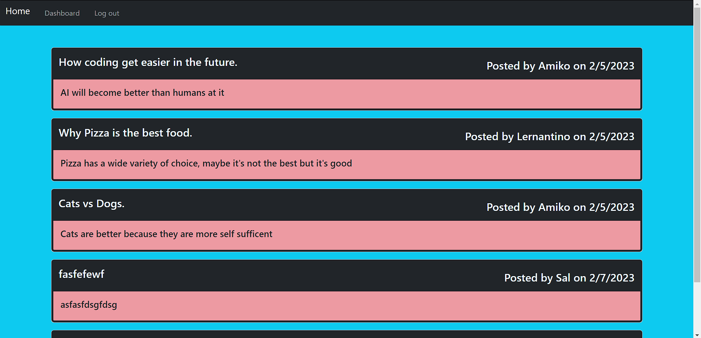

# CSM-Styled Tech Blog

## Description
This is a blog application where you can read posts. Once you have logged-in/signed-up you are then able create posts which you can also edit and delete. Also upon logging-in, you are able to then comment on others posts.

This app uses Handlebars and JavaScript
## User Story
AS A developer who writes about tech
I WANT a CMS-style blog site
SO THAT I can publish articles, blog posts, and my thoughts and opinions

## Visual of Site

## Deployed Link
https://techblogap.herokuapp.com/